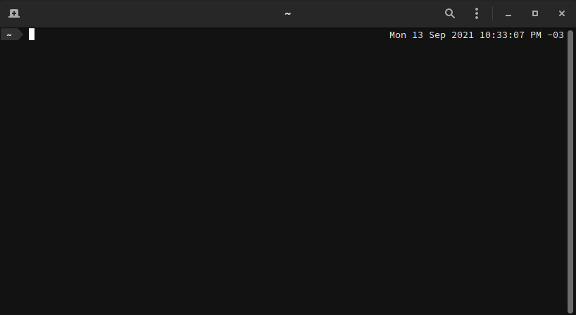

# OPI

**O**BS **P**ackage **I**nstaller

Search and install almost all packages available for openSUSE and SLE:

1. openSUSE Build Service
2. Packman
3. Popular packages for Microsoft and other vendors

## System Requirements

- openSUSE Tumbleweed, openSUSE Leap 42.1+, SLE 12+
- python3
- python3-requests
- python3-lxml
- python3-termcolor

If you want to use dnf instead of zypper, you also need:

- dnf
- libdnf-repo-config-zypp

## Install

### openSUSE Tumbleweed and Leap

```
sudo zypper install opi
```

### SLE

```
# eg. for SLE 15 SP4
sudo SUSEConnect -p PackageHub/15.4/x86_64

sudo zypper refresh
sudo zypper install opi
```

## Use

Run:

```
opi [package_name]
```

Example:

```
opi filezilla
```

Demo:



### Config options

Change the config by editing the content of `/etc/opi.cfg`.

#### Using DNF instead of Zypper

If you want to, you can use [DNF](https://en.opensuse.org/SDB:DNF) instead of Zypper.

```cfg
backend = dnf
```

If you want to go back to Zypper, just change the value of `backend` back to `zypp`.

#### Disabling auto-refresh for new repositories

If you want to, you can disable auto-refreshing of new repositories.

```cfg
new_repo_auto_refresh = false
```

If you want to reactivate auto-refreshing for new repositories, just change the value of `new_repo_auto_refresh` back to `true`.

### Packages from Other Repositories

**Packman Codecs** (enable you to play MP4 videos and YouTube)

```
opi packman

# or

opi codecs
```

```
usage: opi [-h] [-v] [-n] [-P] [-m] [query ...]

openSUSE Package Installer
==========================

Search and install almost all packages available for openSUSE and SLE:
  1. openSUSE Build Service
  2. Packman
  3. Popular packages for various vendors

positional arguments:
  query          can be any package name or part of it and will be searched
                 for both at the openSUSE Build Service and Packman.
                 If multiple query arguments are provided only results
                 matching all of them are returned.

options:
  -h, --help     show this help message and exit
  -v, --version  show program's version number and exit
  -n             run in non interactive mode
  -P             don't run any plugins - only search repos, OBS and Packman
  -m             run installation process individually for each query
                 argument

Also these queries (provided by plugins) can be used to install packages from various other vendors:
  anydesk           AnyDesk remote access
  atom              Atom Text Editor
  brave             Brave web browser
  chrome            Google Chrome web browser
  codecs            Media Codecs from Packman and official repo
  dotnet            Microsoft .NET framework
  jami              Jami p2p messenger
  maptool           Virtual Tabletop for playing roleplaying games
  megasync          Mega Desktop App
  msedge            Microsoft Edge web browser
  ocenaudio         Audio Editor
  plex              Plex Media Server
  resilio-sync      Decentralized file synchronization between devices using bittorrent protocol
  skype             Microsoft Skype
  slack             Slack messenger
  sublime           Editor for code, markup and prose
  teams-for-linux   Unofficial Microsoft Teams for Linux client
  teamviewer        TeamViewer remote access
  vivaldi           Vivaldi web browser
  vscode            Microsoft Visual Studio Code
  vscodium          Visual Studio Codium
  yandex-browser    Yandex web browser
  yandex-disk       Yandex.Disk cloud storage client
  zoom              Zoom Video Conference
```
