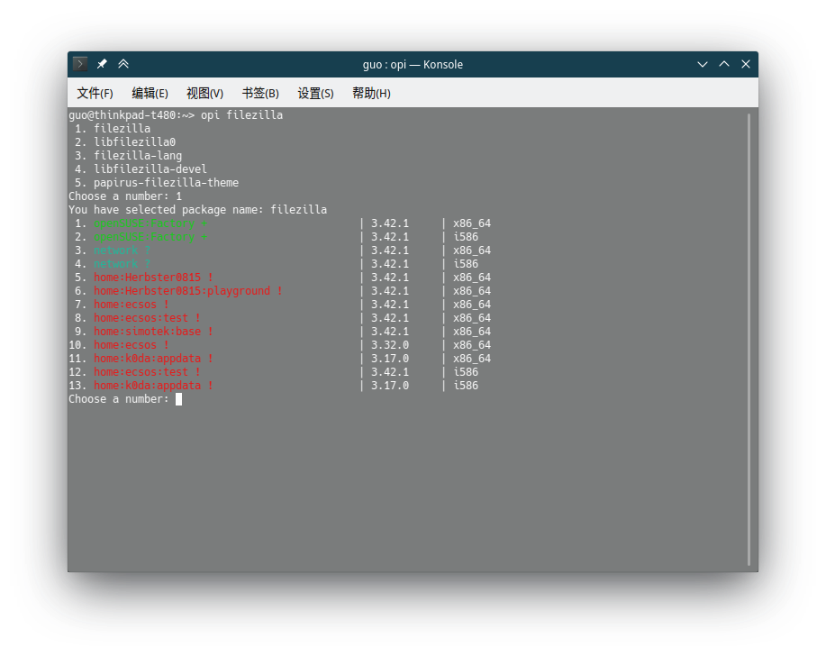

# OPI

**O**BS **P**ackage **I**nstaller

Search and install almost all packages available for openSUSE and SLE:

1. openSUSE Build Service
2. Packman
3. Popular packages for Microsoft and other vendors

## System Requirements

- openSUSE Tumbleweed, openSUSE Leap 42.1+, SLE 12+
- python3
- python3-requests
- python3-lxml
- python3-termcolor

## Install

### openSUSE Tumbleweed and Leap

```
sudo zypper install opi
```

### SLE

```
# SLE 15
sudo zypper addrepo --refresh https://download.opensuse.org/repositories/home:guoyunhe/SLE_15/home:guoyunhe.repo

sudo zypper refresh
sudo zypper install opi
```

## Use

Command:

```
opi filezilla
```

Output:



### Packages from Other Repositories

**Packman Codecs** (enable you to play MP4 videos and YouTube)

```
opi packman

# or

opi codecs
```

```
openSUSE Package Installer
==========================

Search and install almost all packages available for openSUSE and SLE:
 1. openSUSE Build Service
 2. Packman
 2. Popular packages for various vendors

Usage: opi <query>

  <query> can be any package name or part of it and will be searched for
  both at the openSUSE Build Service and Packman.

Also this queries can be used to install packages from various other vendors:

  chrome            Google Chrome webbrowser
  codecs            Media Codecs from Packman Repo
  msteams           Microsoft Teams
  skype             Microsoft Skype
  teamviewer        Teamviewer remote access
  vscode            Microsoft Visual Studio Code
  vscodium          Visual Studio Codium
```
